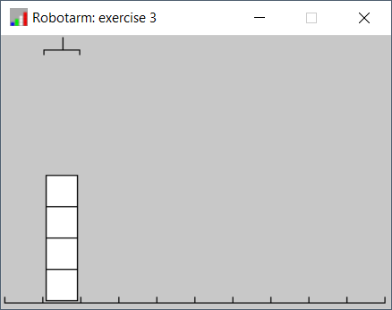
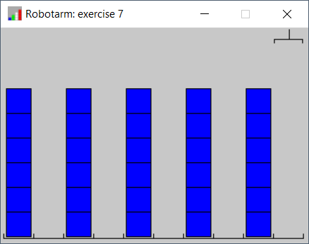
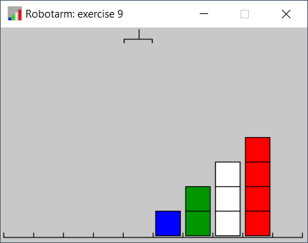
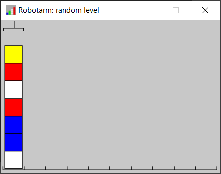

# Robotarm

Lees de instructies op de wiki pagina hoe de robotarm bibliotheek werkt. Vervolgens ga je proberen de onderstaande oefeningen te maken.

## Oefening 1
```python
from RobotArm import RobotArm

robotArm = RobotArm('exercise 1')

# Jouw python instructies zet je vanaf hier:


# Na jouw code wachten tot het sluiten van de window:
robotArm.wait()
```
Verplaats het rode blok één plek naar links.


## Oefening 2
```python
from RobotArm import RobotArm

robotArm = RobotArm('exercise 2')

# Jouw python instructies zet je vanaf hier:


# Na jouw code wachten tot het sluiten van de window:
robotArm.wait()
```
Stappel alle blokken op aan de rechterkant.


## Oefening 3
```python
from RobotArm import RobotArm

robotArm = RobotArm('exercise 3')

# Jouw python instructies zet je vanaf hier:


# Na jouw code wachten tot het sluiten van de window:
robotArm.wait()
```
Verplaats de hele stapel blokken één plek naar rechts.



## Oefening 4
```python
from RobotArm import RobotArm

robotArm = RobotArm('exercise 4')

# Jouw python instructies zet je vanaf hier:


# Na jouw code wachten tot het sluiten van de window:
robotArm.wait()
```
Verplaats de hele stapel blokken één plek naar rechts. Zorg ervoor dat de volgorde van de blokken gelijk blijft.


## Oefening 6
```python
from RobotArm import RobotArm

robotArm = RobotArm('exercise 6')

# Jouw python instructies zet je vanaf hier:


# Na jouw code wachten tot het sluiten van de window:
robotArm.wait()
```
Verplaats alle blokken één plek naar rechts. Zorg ervoor dat de volgorde van de blokken gelijk blijft. 


## Oefening 7
```python
from RobotArm import RobotArm

robotArm = RobotArm('exercise 7')

# Jouw python instructies zet je vanaf hier:


# Na jouw code wachten tot het sluiten van de window:
robotArm.wait()
```
Verplaats iedere stapel één plek naar links.

Je mag maximaal 11 regels code gebruiken inclusief de import, het laden van de robotarm en de wait



## Oefening 8
```python
from RobotArm import RobotArm

robotArm = RobotArm('exercise 8')

# Jouw python instructies zet je vanaf hier:


# Na jouw code wachten tot het sluiten van de window:
robotArm.wait()
```
Verplaats de stapel naar de rechterkant.

Je mag maximaal 11 regels code gebruiken inclusief de import, het laden van de robotarm en de wait


## Oefening 9
```python
from RobotArm import RobotArm

robotArm = RobotArm('exercise 9')

# Jouw python instructies zet je vanaf hier:


# Na jouw code wachten tot het sluiten van de window:
robotArm.wait()
```
Verplaats alle stapels vijf stappen naar rechts.

Je mag maximaal 12 regels code gebruiken inclusief de import, het laden van de robotarm en de wait



## Oefening 10
```python
from RobotArm import RobotArm

robotArm = RobotArm('exercise 10')

# Jouw python instructies zet je vanaf hier:


# Na jouw code wachten tot het sluiten van de window:
robotArm.wait()
```
Draai de volgorde van de blokken om.

Je mag maximaal 15 regels code gebruiken inclusief de import, het laden van de robotarm en de wait


## Oefening 11
```python
from RobotArm import RobotArm

robotArm = RobotArm('exercise 11')

# Jouw python instructies zet je vanaf hier:


# Na jouw code wachten tot het sluiten van de window:
robotArm.wait()
```
Verplaats alle witte blokken één plek naar rechts. 

Let op, de blokken zijn iedere keer anders als je het programma start!


## Oefening 12
```python
from RobotArm import RobotArm

robotArm = RobotArm('exercise 12')

# Jouw python instructies zet je vanaf hier:


# Na jouw code wachten tot het sluiten van de window:
robotArm.wait()
```
Verplaats alle rode blokken naar het einde.

Let op, de blokken zijn iedere keer anders als je het programma start!


## Oefening 13
```python
from RobotArm import RobotArm
# Let op: hier start het anders voor een random level:
robotArm = RobotArm()
robotArm.randomLevel(1,7)

# Jouw python instructies zet je vanaf hier:


# Na jouw code wachten tot het sluiten van de window:
robotArm.wait()
```
Verdeel alle blokken over de lege plaatsen, zodra er geen blokken meer zijn moet de arm stoppen.


resultaat na verdeling ziet er zo uit:


[Bonus opdrachten](https://www.dropbox.com/s/7q4o3xboi5whgop/RobotArm%20Puzzels.docx?dl=0)

Succes!
